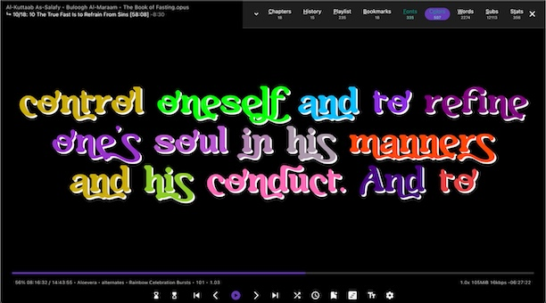
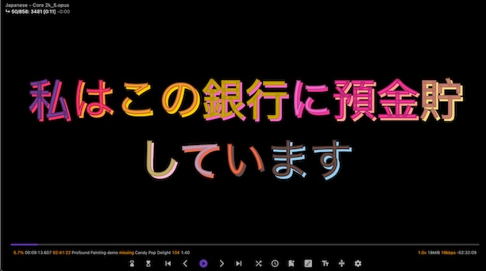

# SubStitcher

Opus chaptered encoder and player with colored subtitles and fancy fonts. Transcribe to vtt subtitles, search through all Chapters, History, Playlist, Bookmarks, Fonts, Colors, Words, Subs, Stats. Dictionary word lookup.



### Encoding and Transcribing
- Encode 16kbps audiobooks which is 4x smaller than 64kbps
- 32kpbs only use for audio like Quran recitations and it's about 2.5x larger in file size due to vbr
- opus (2012) is a superior audio codec compared to mp3 (1993) or aac (1997) at low bitrates
- max 100 hours and 999 chapters per audiobook
- if exceed limits will offer to automatically split into multiple audiobooks
- Title Case chapter titles and regular expression replace
- Transcribe with 30 second segements to reduce hallucination with whisper.cpp
- Remove silence
    ```
      -26dB deep cleaning of silence
      -30dB aggressive removes almost all silence
      -34dB medium removes quite a bit (default)
      -38dB [recommended] a tad conservative removing silence
      -42dB quite conservative and just removes a bit
      -46dB kinda too strict and barely removes stuff

- Hiss (reduction) preview a random audio to compare
- Repeats vtt to remove repeated words, capitalize pronouns, Islamic terms and honorifics
- Batch Trim Audio beginning and end
- Extract chapters with names from audiobooks
- Edit Metadata (chapters, author, title) of opus audiobook


### Playback
- set playback speed 0.5x to 2.0x
- chapter title hide/show for anki audiobooks
- copy metadata audiobook author & title file size
- copy chapter list and write to text file

### Subtitles
- vtt subtitles if srt converts automatically to vtt
- set default font, font size, font line spacing
- apply default font, font size, font line spacing
- left/right arrows advanced to prev/next subtitle
- search foreign language subtitles 



### Dictionary Lookup Words
- d opens dictionary word overlay
- click on word to open Apple Dictionary on Mac
- or on Windows, Linux, Android copy to clipboard
- filters out tons of common words (and, the, to, from, etc.)
- removes repeated words
- History of looked up words clicked on
- Clear or Copy All history to clipboard


- Pause mode 2s, 3s, 5s, 10s or Dictionary mode (forever)
- CJK (Chinese, Japanese, Korean) and Arabic subtitles
- tokenizes Japanese with tiny segmenter
- Chinese and Korean tokenizes pretty well
- Apple Dictionary has following languages to English available as of January 2026:
- Arabic, Bangla, Cantonese, Simplified Chinese, Traditional Chinese, Croatian, Czech, Danish, Dutch, Finnish, French, German, Greek, Gujarati, Hindi, Hungarian, Indonesian, Italian, Japanese, Kannada, Kazakh, Korean, Malay, Malayalam, Norwegian, Polish, Portuguese, Punjabi, Russian, Slovak, Spanish, Swedish, Tamil, Telugu, Thai, Turkish, Ukranian, Urdu, Vietnamese


### Bilingual Subtitles
- audiobookname_vtt sub directory to keep many subs (autoloads)
- automatically changes font size based on length of subtitles
- v Subtitle Manager for bilingual subtitles and loading subs
- x swap top and bottom
- set font and color for 'active subtitle' which is the bottom one
- set font and color for each one top and bottom 


### Sleeptimer
-  set to 15, 30, 45, 60, 90, 120 minutes
- z sleep at chapter end
- sleep at End of Audiobook
- Z cancel sleep timer
- pause or adjusting playback speed also cancels sleep timer
- warning of 60 seconds before closing app
- if paused when setting sleep timer, playback is started

### Chapters
- search and prevent chapters from players based on chapter title
- shuffle chapters for lectures or vocab learning
- keeps track of which chapters have been shuffled so doesn't repeat
- shows duration of each chapter (ffprobe)
- search through all chapters in entire plays (under Subs panel)


### History
- shows audiobook title with chapter title and time position
- duration of audiobook
- percent progress of total timeline position
- timeline position of where it'll resume
- press h 1-9 to quickly open history entries
- sorted by most recent
- only shows most recent chapter with a particular audiobook


### Playlist
- set up to 10 playlists and switch between them
- search through entire playlist
- p 1-9 to quickly open playlist entries


### Bookmarks
- shows audiobook title with chapter title and time position
- pin up to 9 bookmarks
- press b 1-9 to quickly open bookmark entries
- mutiple bookmarks from same audiobook grouped together
- sorted by most recently added

### Fonts
- ligatures fonts, missing ligatures, alternates, fonts must be uppercase
- 333+ fonts
- demo fonts, demo123 (still demo but not missing numbers)
- free (free for commerical use)
- each missing and each alternate font, subs must be converted
- ligature demo fonts, subs need converting only once
- alternates don't work with mixed CJK and Latin text on same subtitle line


### Colors
- 500 color palettes
- choose between coloring words or letters
- 20 and 12 colors per palette
- 90 Simple Palettes (one font color with a shadow color)
- monochromatic, food palettes
- letters work with alternates but not with ligatures


### Words
- analyzing vtt subtitles for word frequencies
- top 500 words by frequency
- click top 500 words to search subtitles and paragraphs
- top 7-word, 6-word, 5-word, 4-word, 3-word phrases
- click phrases to do exact phrase match in subs and paragraphs
- words are automatically analyzed after 20 seconds of audiobook loading

### Subs
- search through entire subs and click on results to navigate to time position in audiobook
- search paragraphs too, paragraphs are ~ 8 sentences
- click paragraph to copy to clipboard 
- search through entire playlist chapters of entire playlist
- indexes all chapters for every audiobook to be searched
- press ENTER to search subtitles
- / to start search (focus in search field)
- Ctrl+Backspace or Cmd+Backspace to clear search results
- TAB to focus elsewhere so keyboard shortcuts work


### Stats
- Shows Active Days which are at least 30 mins of listening
- Daily streaks
- Longest 3 days of total listening time
- Today, Yesterday, 2 to 10 days ago of listening activity
- shows duration of listen audiobook title as well as which chapter listened to
- shows total cumulative listening time of each audiobook from all chapters
- average time per chapter
- top 50 audiobooks listened to by duration
- time duration bars of listening time for last 30 active days


### Adhan Clock
- prayer times
- White Days
- auto-detect location or set coordinates
- location is valid for 30 days (cached)


### Anki to Opus 
- Anki to opus chaptered audiobook (4x repeat vocab, show 2x front, 2x back subs)
- if over 999 notes (rows with audio) then automatically creates multiple audiobooks part 1, part 2, part 3, etcetera
- Arabic, Bengali, Chinese, Czech, Danish, Dutch, English, Filipino, French, German, Greek, Hebrew, Hindi, Hungarian, Indonesian, Italian, Japanese, Korean, Marathi, Norwegian, Pashto, Persian, Polish, Portuguese, Punjabi, Romanian, Russian, Spanish, Swedish, Tamil, Telugu, Thai, Turkish, Urdu, Vietnamese
- Nearly 1,000 anki to opus audiobooks on telegram channel https://t.me/Anki2Opus if too lazy to make your own


### Youtube
- handles videos or audio to stream
- displays subs automatically if avaiable based on default language
- choose up to 10 languages to prompt to get sub in
-  English, Afrikaans, Albanian (Shqip), Amharic (አማርኛ), Arabic (العربية), Armenian (Հայերեն), Azerbaijani (Azərbaycan), Belarusian (Беларуская), Bengali (বাংলা), Bhojpuri (भोजपुरी), Bosnian (Bosanski), Bulgarian (Български), Burmese (မြန်မာ), Catalan (Català), Chinese - Simplified (简体), Chinese - Traditional (繁體), Chinese - Cantonese (粵語), Croatian (Hrvatski), Czech (Čeština), Danish (Dansk), Dutch (Nederlands), Estonian (Eesti), Filipino (Tagalog), Finnish (Suomi), French (Français), Georgian (ქართული), German (Deutsch), Greek (Ελληνικά), Gujarati (ગુજરાતી), Hausa (هَرْشٜىٰن هَوْسَا), Hebrew (עברית), Hebrew (עברית), Hindi (हिन्दी), Hungarian (Magyar), Icelandic (Íslenska), Indonesian (Bahasa Indonesia), Italian (Italiano), Japanese (日本語), Javanese (Basa Jawa), Kannada (ಕನ್ನಡ), Kazakh (Қазақ тілі), Korean (한국어), Kyrgyz (Кыргызча), Lao (ລາວ), Latvian (Latviešu), Lithuanian (Lietuvių), Macedonian (Македонски), Malay (Bahasa Melayu), Malayalam (മലയാളം), Maltese (Malti), Marathi (मराठी), Mongolian (Монгол), Nepali (नेपाली), Norwegian (Norsk bokmål), Persian (فارسی), Polish (Polski), Portuguese (Português), Portuguese - Brazil (Português Brasil), Portuguese - Portugal (Português Portugal), Punjabi (ਪੰਜਾਬੀ), Romanian (Română), Russian (Русский), Serbian (Српски), Slovak (Slovenčina), Slovenian (Slovenščina), Spanish (Español), Swahili (Kiswahili), Swedish (Svenska), Tajik (Тоҷикӣ), Tamil (தமிழ்), Telugu (తెలుగు), Thai (ไทย), Turkish (Türkçe), Turkmen (Türkmençe), Ukrainian (Українська), Urdu (اردو), Uyghur (ئۇيغۇرچە), Uzbek (Oʻzbekcha), Vietnamese (Tiếng Việt)
- can download video or audio and playlists

### Installation
macOS (arm64 Silicon m1,m2,m3,m4,m26) after install dmg in Terminal do
```bash
xattr -dr com.apple.quarantine /Applications/SubStitcher.app
```
If using whisper large v2 model on 8GB RAM Mac swap file might become huge especially with other apps open.  Swap file will never clear and takes up valuable disk space until rebooting. Log out of user account and login again which is even quicker way to delete swap file.

Windows x64\
just unzip SubStitcher-windows-x64.zip\
if nothing appears, may need to install\
[Visual C++ 2015-2022 Redistributable](https://aka.ms/vs/17/release/vc_redist.x64.exe)

Linux Appimage\
appimage right click on file and choose Properties, then Permissions\
check Allow executing file as program\
or do below
```bash
chmod +x  substitcher-x64.AppImage
```
Transcribing with whisper.cpp won't work on CPUs without AVX which is usually ones before 2014

Android  universal (arm64-v8a + armeabi-v7a + x86_64) (untested, feedback welcome)
- Android 8.0+ Tap Settings in the prompt
- Enable Allow from this source for your browser/file manager
- Go back and tap Install

- Older Android (pre-8.0) Go to Settings → Security
- Enable Unknown sources

iOS (may publish in future)
- if needs subs (just one color, one font) nPlayer $5
- vlc iOS/android works but no subs for opus audiobooks, set audio to resume

### Opus audio codec
Why Opus outperforms MP3 and AAC at very low bitrates (like ~16 kb/s)

#### Hybrid Architecture
- **SILK** (linear predictive coding) for speech-like signals.

#### Low Algorithmic Delay and Frame Flexibility
- Supports frame sizes from **2.5 ms** up to **60 ms**, allowing very low latency if needed
- Fine control of bitrate and delay trade-offs further improves coding of speech/music at low rates

### `-application voip` (OPUS_APPLICATION_VOIP)
-  gives best quality at a given bitrate for voice signals. It enhances the input signal by high-pass filtering and emphasizing formants and harmonics

### Miscellaneous
- never will support, music, videos as it's an audiobook only
- unlikely will get light theme
- built a audio/sub extract and used original subs but got out of synch due to padding when re-encoding
- so if do again will just extract audio segments and keep together those in chapters, must transcribe for subs though
- developed since 2022 but in Dec 2025 decided to port from mpv front-end lua scripts with uosc ui and remove video editing, LUTs to a flutter / dart app (not just Mac/Linux anymore) and purely focus an audiobook player