# SubStitcher

Opus chaptered audiobook player, encoder and editor with colored subtitles and fancy fonts. Transcribe to vtt subtitles, search through all Chapters, History, Playlist, Bookmarks, Fonts, Colors, Words, Subs, Stats. Dictionary word lookup. Basic Video Editing. Mac (dmg or homebrew), Linux (appimage, AUR, flatpak), Windows (zip), Android

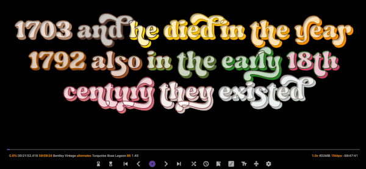

### Encoding opus Chaptered Audiobooks
- Encode 16kbps audiobooks which is 4x/6x/8x smaller than 64/96/128kbps
- 32kpbs only use for audio like Quran recitations and it's about 2.5x larger in file size due to vbr
- opus (2012) is a superior audio codec compared to mp3 (1993) or aac (1997) at low bitrates
- max 100 hours and 999 chapters per audiobook
- if exceed limits will offer to automatically split into multiple audiobooks showing the split points
- Title Case chapter titles and regular expression replace
- Remove silence -26dB, -30dB, -34dB, -38dB, -42dB, -46dB, reduces transcribing hallucinations
- Hiss (reduction) preview a random audio to compare
- Batch Trim Audio beginning and end, previews 6 trimmed audios
- Extract chapters with names from audiobooks
- Edit Metadata (chapters, author, title) of opus audiobook
- Paste List of text to rename files, two surah lists

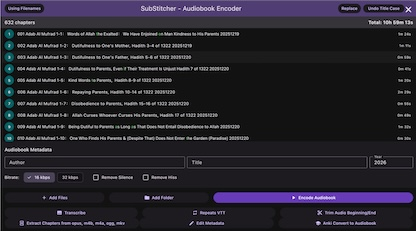

### Transcribe
- Transcribe with 30 second segments to reduce hallucination with whisper.cpp, keeps model in memory for entire chapter
- Repeats vtt to remove repeated words, capitalize pronouns, Islamic terms and honorifics
- Auto-detect language
- Automatically translate to English only from a foreign language if using whisper 2 models but not turbo 3
- Custom Prompt should use language of audio being transcribed.  Use a few punctuation.  Remebers last 4 used prompts plus default.
<details>
<summary>Transcribe for the following languages: </summary>

- Afrikaans, Albanian, Amharic, Arabic, Armenian, Azerbaijani, Basque, Belarusian, Bengali, Bosnian, Bulgarian, Catalan, Cebuano, Chichewa, Chinese, Cantonese (CN), Cantonese (HK), Mandarin (TW), Corsican, Croatian, Czech, Danish, Dutch, English, Esperanto, Estonian, Filipino, Finnish, French, Western Frisian, Galician, Georgian, German, Greek, Gujarati, Haitian Creole, Hausa, Hawaiian, Hebrew, Hindi, Hmong, Hungarian, Icelandic, Igbo, Indonesian, Irish, Italian, Japanese, Javanese, Kannada, Kazakh, Khmer, Kinyarwanda, Korean, Kurdish, Kyrgyz, Lao, Latin, Latvian, Lithuanian, Luxembourgish, Macedonian, Malagasy, Malay, Malayalam, Maltese, Māori, Marathi, Mongolian, Myanmar, Nepali, Norwegian, Odia, Pashto, Persian, Polish, Portuguese, Punjabi, Romanian, Russian, Samoan, Scottish Gaelic, Serbian, Sesotho, Shona, Sindhi, Sinhala, Slovak, Slovenian, Somali, Spanish, Sundanese, Swahili, Swedish, Tajik, Tamil, Tatar, Telugu, Thai, Turkish, Turkmen, Ukrainian, Urdu, Uyghur, Uzbek, Vietnamese, Welsh, Xhosa, Yiddish, Yoruba, Zulu
</details>

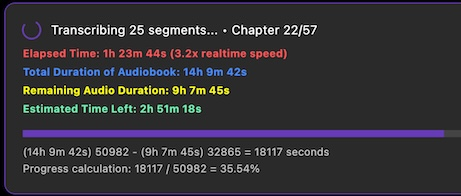

### Playback
- set playback speed 0.5x to 2.0x
- chapter title hide/show for anki audiobooks
- copy metadata audiobook author & title file size
- copy chapter list and write to text file

### Subtitles
- vtt subtitles if srt converts automatically to vtt
- set default font, font size, font line spacing
- apply default font, font size, font line spacing
- left/right arrows advanced to prev/next subtitle
- use primary / secondary at same time, i.e. bilingual subs
- search foreign language subtitles
- blur shadow (uses 2x cpu usage) but dims it a bit

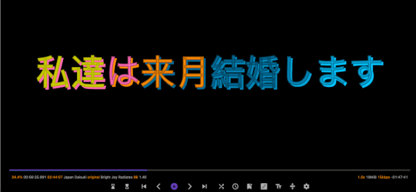

### Dictionary Lookup Words
- d opens dictionary word overlay
- click on word to open Apple Dictionary on Mac
- or on Windows, Linux, Android copy to clipboard
- filters out tons of common words (and, the, to, from, etc.)
- removes repeated words
- History of looked up words clicked on
- Clear or Copy All history to clipboard

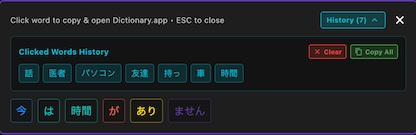

- Pause mode 2s, 3s, 5s, 10s or Dictionary mode (forever)
- CJK (Chinese, Japanese, Korean) and Arabic subtitles
- tokenizes Japanese with tiny segmenter
- Chinese and Korean tokenizes pretty well
- Apple Dictionary has following languages to English available as of February 2026:
- Arabic, Bangla, Cantonese, Simplified Chinese, Traditional Chinese, Croatian, Czech, Danish, Dutch, Finnish, French, German, Greek, Gujarati, Hindi, Hungarian, Indonesian, Italian, Japanese, Kannada, Kazakh, Korean, Malay, Malayalam, Norwegian, Polish, Portuguese, Punjabi, Russian, Slovak, Spanish, Swedish, Tamil, Telugu, Thai, Turkish, Ukranian, Urdu, Vietnamese


### Subtitle  Manager
- bilingual subtitles
- audiobookname_vtt sub directory to keep many subs (autoloads)
- automatically changes font size based on length of subtitles
- v Subtitle Manager for bilingual subtitles and loading subs
- x swap top and bottom subtitles
- set font and color for 'active subtitle' which is the bottom one
- set font and color for each one top and bottom 
- converts srt to vtt automatically


### Sleep Timer
-  set to 15, 30, 45, 60, 90, 120 minutes
- z sleep at chapter end
- sleep at End of Audiobook
- Z cancel sleep timer
- pause or adjusting playback speed also cancels sleep timer
- warning of 120 seconds before closing app
- if paused when setting sleep timer, playback is started

### Chapters
- search and prevent chapters from players based on chapter title
- shuffle chapters for lectures or vocab learning
- keeps track of which chapters have been shuffled so doesn't repeat
- shows duration of each chapter (ffprobe)
- search through all chapters in entire plays (under Subs panel)


### History
- shows audiobook title with chapter title and time position
- duration of audiobook
- percent progress of total timeline position
- timeline position of where it'll resume
- press h 1-9 to quickly open history entries
- sorted by most recent
- only shows most recent chapter with a particular audiobook

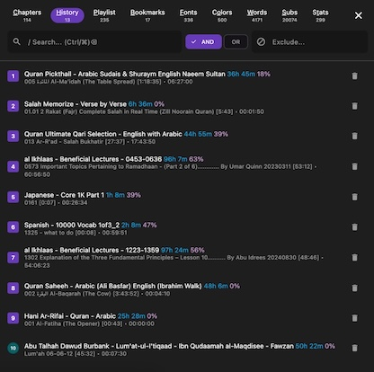


### Playlist
- set up to 10 playlists and switch between them
- search through entire playlist
- p 1-9 to quickly open playlist entries


### Bookmarks
- shows audiobook title with chapter title and time position
- pin up to 9 bookmarks
- press b 1-9 to quickly open bookmark entries
- mutiple bookmarks from same audiobook grouped together
- sorted by most recently added

### Fonts
- ligatures fonts, missing ligatures, alternates, fonts must be uppercase
- 333+ fonts
- demo fonts, demo123 (still demo but not missing numbers)
- free (free for commerical use)
- each missing and each alternate font, subs must be converted
- ligature demo fonts, subs need converting only once
- alternates don't work with mixed CJK and Latin text on same subtitle line
- favorites list
- choose own custom folder for own fonts, refresh for added fonts, must restart app though to clear out removed fonts
- custom folder can have subfolders although all fonts will be sorted alphabetically
- 500+ LUTs (color presets) applied to subtitles and existing color palettes, hidden to right of Stats tab


### Glyph Viewer
only 1-9, basic latin and ligatures

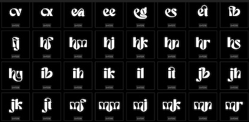

### Colors
- 750+ color palettes
- choose between coloring words or letters
- 20 and 12 colors per palette
- 91 same (similar) Palettes (font, stroke, shadow)
- monochromatic, food palettes
- letters work with alternates but not with ligatures
- favorites list, shortcut key R (rang रंग Hindi is color)


### Words
- analyzing vtt subtitles for word frequencies
- top 500 words by frequency
- click top 500 words to search subtitles and paragraphs
- top 7-word, 6-word, 5-word, 4-word, 3-word phrases
- click phrases to do exact phrase match in subs and paragraphs
- words are automatically analyzed after 20 seconds of audiobook loading

### Subs
- search through entire subs and click on results to navigate to time position in audiobook
- search paragraphs too, paragraphs are ~ 8 sentences
- click paragraph to copy to clipboard 
- search through entire playlist chapters of entire playlist
- indexes all chapters for every audiobook to be searched
- press ENTER to search subtitles
- / to start search (focus in search field)
- Ctrl+Backspace or Cmd+Backspace to clear search results
- TAB to focus elsewhere so keyboard shortcuts work


### Stats
- Shows Active Days which are at least 30 mins of listening
- Daily streaks
- Longest 3 days of total listening time
- Today, Yesterday, 2 to 10 days ago of listening activity
- shows duration of listen audiobook title as well as which chapter listened to
- shows total cumulative listening time of each audiobook from all chapters
- average time per chapter
- top 50 audiobooks listened to by duration
- time duration bars of listening time for last 30 active days
- stats are stored in `~/.config/substitcher/watch_tracking_time`


### Slicing / Editing
- make cuts (slices of audio) in subdirectory audiobookname_cuts
- make an audiobook from audiobookname_cuts and transcribe for subs
- first encode video to audiobook then slice on audiobook, avoids keyframe issues for precise timing
- i and o to set in/out point 
- Listen plays 900ms of audio and pauses
- backward, Listen to audio from position
- foward, Listen to audio just before position
- ; Listen, seek to End of Sub
- j and k Listen, backward/forward 1s
- , and . Listen, backward/forward 100ms

### Adhan Clock
- prayer times
- White Days
- auto-detect location or set coordinates
- location is valid for 30 days (cached)


### Anki to Opus 
- Anki to opus chaptered audiobook (4x repeat vocab, show 2x front, 2x back subs)
- if over 999 notes (rows with audio) then automatically creates multiple audiobooks part 1, part 2, part 3, etcetera
- Arabic, Bengali, Chinese, Czech, Danish, Dutch, English, Filipino, French, German, Greek, Hebrew, Hindi, Hungarian, Indonesian, Italian, Japanese, Korean, Marathi, Norwegian, Pashto, Persian, Polish, Portuguese, Punjabi, Romanian, Russian, Spanish, Swedish, Tamil, Telugu, Thai, Turkish, Urdu, Vietnamese
- Nearly 1,000 anki to opus audiobooks on telegram channel https://t.me/Anki2Opus if too lazy to make your own

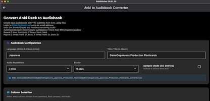

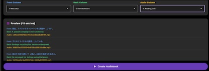

sample anki to opus audiobook from here [124MiB](https://ankiweb.net/shared/info/696438310)\
down to 13MiB with 4x repeating audio 1h 57m\
\
try Pause mode 2s, Hide Chapter Title, Shuffle 

### Translate vtt Subtitles
- translate with TranslateGemma
- choose on vtt file and translation into 16 different langauges simutaneously
- using translategemma-4b-it.Q4_K_M.gguf 2.5GB model, works with only 8GB RAM
- translate into these languages (either from or to)
- English, Arabic, Dutch, French, German, Italian, Portuguese, Spanish, Swedish, Russian, Chinese, Japanese, Korean, Thai, Vietnamese, Indonesian, Bengali
- missing Filipino, Hindi, Polish, Turkish due to bad accuracy
- resume translation if necessary
- online vtt subs translate much faster but vvt must be 977KB or less
- this is offline and subs can be 7MB for instance

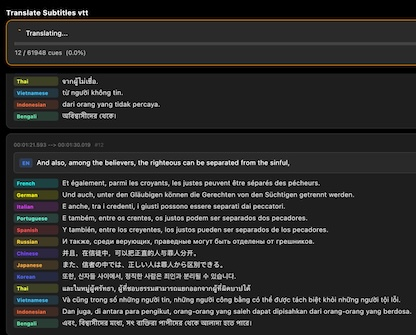

### Youtube
- handles videos or audio to stream (ignored for History, Stats), disabled on android/iOS
- download video or audio and playlists with option to resume includes soundcloud and spreaker
- displays subs automatically if avaiable based on default language
- choose audio streams
- choose up to 10 languages to prompt when default language isn't found, this enables a shortlist rather than scrolling through 79 languages each time

<details>
<summary>list of languages</summary>

-  English, Afrikaans, Albanian (Shqip), Amharic (አማርኛ), Arabic (العربية), Armenian (Հայերեն), Azerbaijani (Azərbaycan), Belarusian (Беларуская), Bengali (বাংলা), Bhojpuri (भोजपुरी), Bosnian (Bosanski), Bulgarian (Български), Burmese (မြန်မာ), Catalan (Català), Chinese - Simplified (简体), Chinese - Traditional (繁體), Chinese - Cantonese (粵語), Croatian (Hrvatski), Czech (Čeština), Danish (Dansk), Dutch (Nederlands), Estonian (Eesti), Filipino (Tagalog), Finnish (Suomi), French (Français), Georgian (ქართული), German (Deutsch), Greek (Ελληνικά), Gujarati (ગુજરાતી), Hausa (هَرْشٜىٰن هَوْسَا), Hebrew (עברית), Hebrew (עברית), Hindi (हिन्दी), Hungarian (Magyar), Icelandic (Íslenska), Indonesian (Bahasa Indonesia), Italian (Italiano), Japanese (日本語), Javanese (Basa Jawa), Kannada (ಕನ್ನಡ), Kazakh (Қазақ тілі), Korean (한국어), Kyrgyz (Кыргызча), Lao (ລາວ), Latvian (Latviešu), Lithuanian (Lietuvių), Macedonian (Македонски), Malay (Bahasa Melayu), Malayalam (മലയാളം), Maltese (Malti), Marathi (मराठी), Mongolian (Монгол), Nepali (नेपाली), Norwegian (Norsk bokmål), Persian (فارسی), Polish (Polski), Portuguese (Português), Portuguese - Brazil (Português Brasil), Portuguese - Portugal (Português Portugal), Punjabi (ਪੰਜਾਬੀ), Romanian (Română), Russian (Русский), Serbian (Српски), Slovak (Slovenčina), Slovenian (Slovenščina), Spanish (Español), Swahili (Kiswahili), Swedish (Svenska), Tajik (Тоҷикӣ), Tamil (தமிழ்), Telugu (తెలుగు), Thai (ไทย), Turkish (Türkçe), Turkmen (Türkmençe), Ukrainian (Українська), Urdu (اردو), Uyghur (ئۇيغۇرچە), Uzbek (Oʻzbekcha), Vietnamese (Tiếng Việt)
</details>

### Video Editing (not on Android)
- basic video editing to make multiple cuts and combine cuts
- cuts in Substitcher use hardware accelerated cuts which take longer but are precise cuts
- cuts are huge in file size but combine all cuts encodes to x264 or x265 which are cpu encoded and small in file size
- LosslessCut works great but can't make accurate cuts
- blur up to two regions, only for cuts
- even though ffmpeg is bundled with SubStitcher it is limited to audio only pretty much due to licensing restrictions since x264 and x265 are GPL so if wish to use Video Editing must install the full ffmpeg
- flutter limitations with media_kit don't allow filters to be applied in realtime unlike mpv lua scripts.  So can't have audio filtering nor LUTs showing on video
- HOME seek to start of media, END seek to end of media

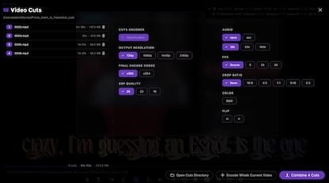

### Motion-Tracking Blur (MacOS only)
- motion-tracking blur as well as invert mode which blurs out everything except motion-tracked object
- motion-tracking has to encode cut once, run motion-tracking for object on cut, then encode cut again, so be patient
- considering motion-tracking blur on Windows (Linux not possible)


### LUTs
- 500+ LUTS (lookup tables which are color presets for images/videos)
- all free and can be applied to video cuts
- Lut Picker showing original set in point frame with 5 LUTs previewed at a time
- choose category/author for quick navigation
- favorites list
- 200MB cache limit and clears on app close
- Preview all 500+ LUTS quickly use html thumbnail gallery
- 


### Installation
<details>
<summary>macOS 11.0+ (arm64 Silicon m1,m2,m3,m4,m5) dmg or homebrew</summary>

[releases](https://github.com/mrfragger/substitcher/releases) or via homebrew in Terminal do

Homebrew
```bash
brew install --cask mrfragger/substitcher/substitcher
```
```brew update```\
```brew info substitcher```\
```brew upgrade substitcher```\
```brew uninstall substitcher```

after installing dmg from releases or via homebrew in terminal remove quarantine flag
```bash
xattr -dr com.apple.quarantine /Applications/SubStitcher.app
```
</details>

<details>
<summary>Windows x64</summary>

just unzip SubStitcher-windows-x64.zip [releases](https://github.com/mrfragger/substitcher/releases)\
if nothing appears, may need to install [Visual C++ 2015-2022 Redistributable](https://aka.ms/vs/17/release/vc_redist.x64.exe)
</details>

<details>
<summary>Linux Appimage, AUR, Flatpak</summary>

Linux Appimage\
appimage right click on file and choose Properties, then Permissions\
check Allow executing file as program\
or do below
```bash
chmod +x  substitcher-x64.AppImage
```
Transcribing with whisper.cpp won't work on CPUs without AVX which is usually ones before 2014

Linux Arch [AUR package](https://aur.archlinux.org/packages/substitcher-bin) yay or paru
```bash
yay -S substitcher-bin
```
```bash
paru -S substitcher-bin
```

Flatpak
```bash
flatpak install substitcher-x64.flatpak
```
</details>

<details>
<summary>Android</summary>

Android (64-bit devices only, arm64-v8a)
- Requires Android 7.0+ (API 24+)
- ARM64 devices (99% of modern Android phones, 2015+)
- Tap Settings when prompted and enable installation from your browser
</details>

<details>
<summary>iOS (may publish in future)</summary>

- with subs (just one color, one font) nPlayer $5
- no subs for opus audiobooks, vlc (set audio to resume)
</details>

### Various
<details>
<summary>Opus audio codec</summary>

- outperforms MP3 and AAC at very low bitrates (~16 kb/s)
-  **Hybrid Architecture** SILK (linear predictive coding) for speech-like signals.

- **Low Algorithmic Delay and Frame Flexibility** Supports frame sizes from 2.5 ms up to 60 ms, allowing very low latency if needed. Fine control of bitrate and delay trade-offs further improves coding of speech/music at low rates

- `-application voip` gives best quality at a given bitrate for voice signals. It enhances the input signal by high-pass filtering and emphasizing formants and harmonics
</details>

<details>
<summary>Miscellaneous</summary>

- Substicher is a flutter app so small in size.  It appears big but isn't all that huge.
- 70MB fonts and 65MB LUTs. So Mac app size is 228MB  - 135MB (assets) = 93MB
- Never will get a light theme nor support music
- Never will support cover images, choose audiobooks with covers and not to use subtitles, use kid3 app (qt free cross-platform app) for embedding a cover image
- Reason is most audiobook players don't support subtitles, and ones that do, do so due to video support and having a cover image in background intefers with subtitles in most cases
- It just puts a 16x9 black png image with META_BLOCK_PICTURE some info which is conforms to vorbis comment specification
- encode wma or flv or other old codecs just batch convert them to opus then encode those to an opus chaptered audiobook
- `parallel ffmpeg -i {} -c:a libopus -b:a 32k {.}.opus ::: *.wma` 
- `parallel ffmpeg -i {} -c:a libopus -b:a 32k {.}.opus ::: *.flv`
- Developed since 2022 but in Dec 2025 decided to port from mpv front-end lua scripts with uosc ui, LUTs to a flutter / dart app (not just Mac/Linux anymore) and make it purely an audiobook player with some basic video editing
- Edit fonts, create own fonts https://www.glyphrstudio.com/app (free)
- view detailed info about fonts https://fontdrop.info (free)
</details>

<details>
<summary>Mac App Recommendations</summary>

- Transnomino, free file-renamer https://www.transnomino.com
- Lulu, free open-source firewall https://objective-see.org/products/lulu.html
- Stats, free menu bar stats monitoring https://github.com/exelban/stats
- Mole, for terminal, cleans up disk space https://github.com/tw93/Mole
- KeepassXC, free password manager https://keepassxc.org
- Screen Kite, free record screen area with system sound, better than OBS https://www.screenkite.com 
- VSCodium, half file size of VSCode https://vscodium.com
- Text Power Tools, extension for VSCodium, powerful text manipulation
- LocalSend, flutter app share files, free https://localsend.org
- Shotcut, add images, mutli-track video editor, free, learning curve https://shotcut.org
- DaVinci resolve free up to 1080p but requires 16GB RAM bare minimum and massive learning curve, expensive

</details>

<details>
<summary>tts (text to speech) that support chapters</summary>
my opinon of voice quality

- kokoro > edge > piper
- Qwen3 and echo-tts are better than kokoro but require 16GB RAM minimum
- KokoroTTS, piper.ttstool.com and edge-tts all are free to use

https://github.com/kjyv/KokoroTTS Mac only

- English (American and British) only 
- stays at 1GB memory usage amazingly
- Paste text, save wav audio file
- Just as fast as mlx-audio without RAM hitting 10GB due to python

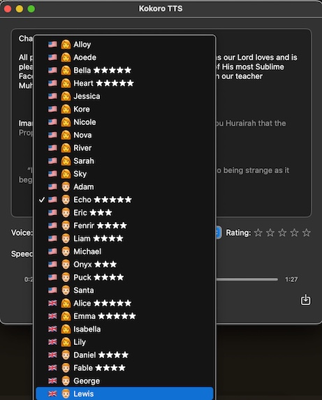

https://piper.ttstool.com
- ~63MB download per voice, fast local cpu processing
- (~3min mac m1 for 30KB text), right-click save as wav audio file
- English (Great Britain)
- alba[medium]
- northern_english_male[medium]
- English (United States)
- amy[medium]
- hfc_female[medium]
- hfc_male[medium]
- joe[medium]

https://github.com/rany2/edge-tts 10.2k \
edge-tts --voice en-CA-LiamNeural -f 002.txt --write-media edge.mp3 \
takes 2 mins to process 30KB text \  
Online processing using Microsoft servers

male voices - General and  Friendly, Positive unless specified otherwise

en-AU-WilliamMultilingualNeural               
en-US-AndrewMultilingualNeural           Conversation, Copilot  Warm, Confident, Authentic, Honest    
en-US-BrianMultilingualNeural            Conversation, Copilot  Approachable, Casual, Sincere

en-CA-LiamNeural                                        
en-GB-RyanNeural                                        
en-GB-ThomasNeural                                      
en-NZ-MitchellNeural                                    
en-US-AndrewNeural                       Conversation, Copilot  Warm, Confident, Authentic, Honest\
en-US-BrianNeural                        Conversation, Copilot  Approachable, Casual, Sincere\
en-US-ChristopherNeural                  News, Novel            Reliable, Authority\
en-US-EricNeural                         News, Novel            Rational\
en-US-GuyNeural                          News, Novel            Passion\
en-US-RogerNeural                        News, Novel            Lively\
en-US-SteffanNeural                      News, Novel            Rational

female voices - General and  Friendly, Positive unless specified otherwise

en-US-AvaMultilingualNeural            Conversation, Copilot  Expressive, Caring, Pleasant, Friendly\
en-US-EmmaMultilingualNeural           Conversation, Copilot  Cheerful, Clear, Conversational

en-AU-NatashaNeural                                   
en-CA-ClaraNeural                                     
en-GB-LibbyNeural                                     
en-GB-MaisieNeural                                    
en-GB-SoniaNeural          
en-NZ-MollyNeural                                
en-US-AnaNeural                        Cartoon, Conversation  Cute\
en-US-AriaNeural                       News, Novel            Positive, Confident\
en-US-AvaNeural                        Conversation, Copilot  Expressive, Caring, Pleasant, Friendly\
en-US-EmmaNeural                       Conversation, Copilot  Cheerful, Clear, Conversational\
en-US-JennyNeural                                      Friendly, Considerate, Comfort\
en-US-MichelleNeural                   News, Novel            Friendly, Pleasant

</details>
